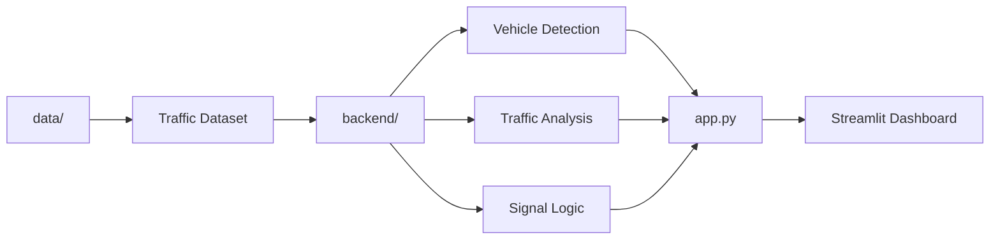

```mermaid
flowchart LR

A[data/] --> B[Traffic Dataset]
B --> C[backend/]

C --> D[Vehicle Detection]
C --> E[Traffic Analysis]
C --> F[Signal Logic]

D --> G[app.py]
E --> G
F --> G

G --> H[Streamlit Dashboard]
```